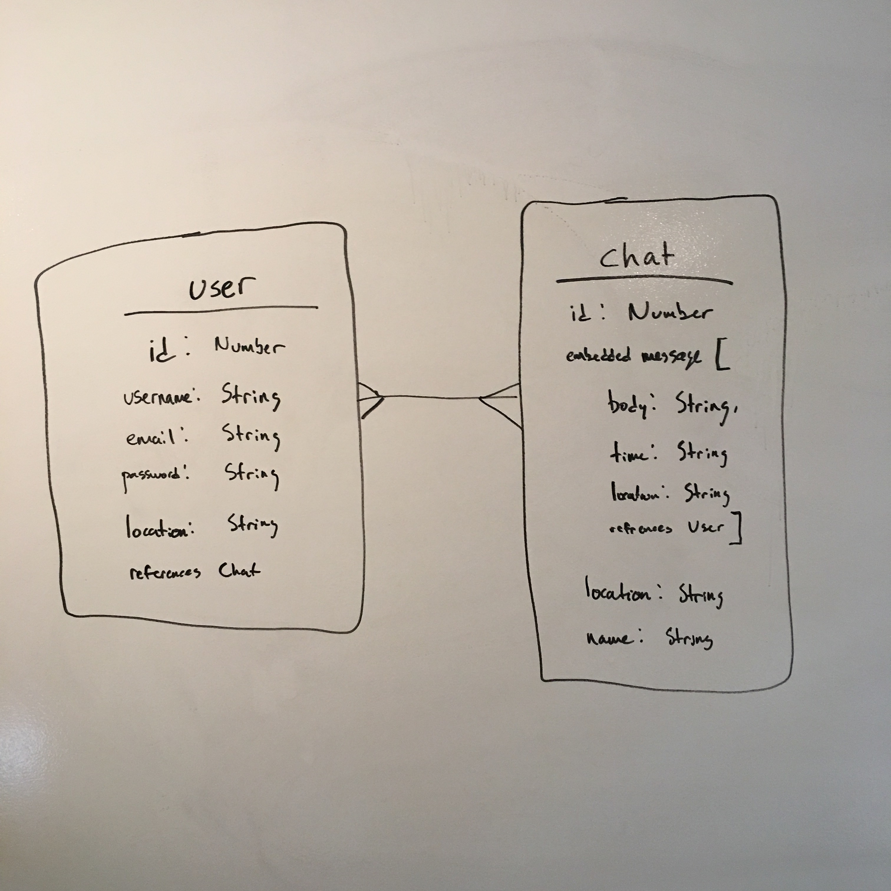
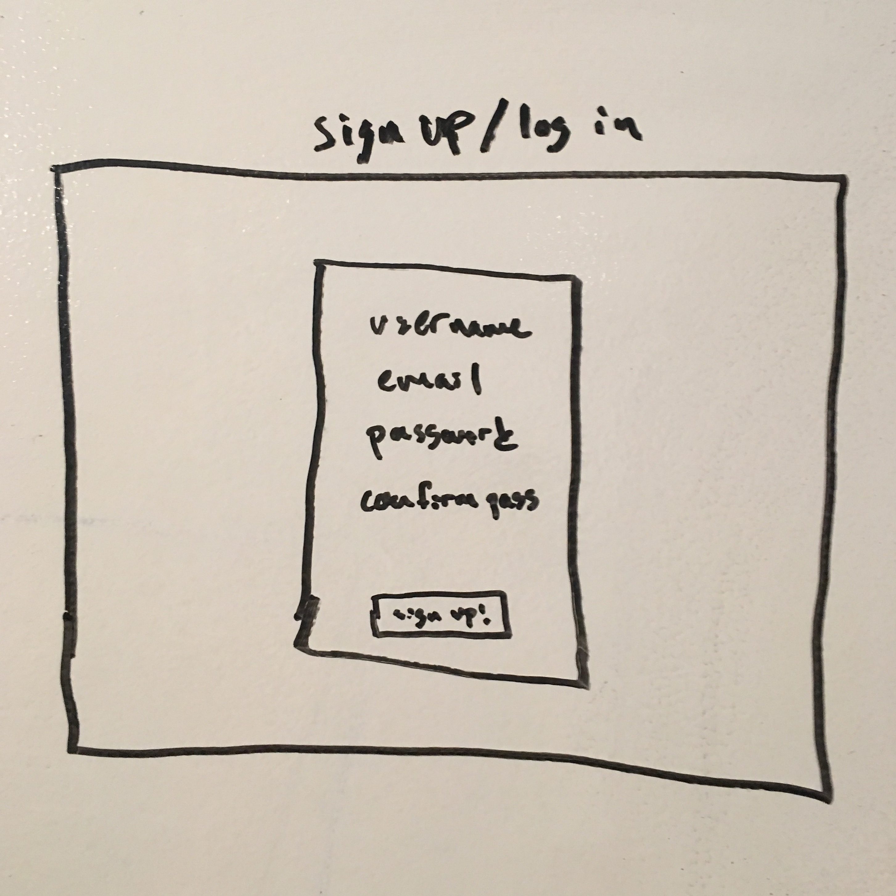
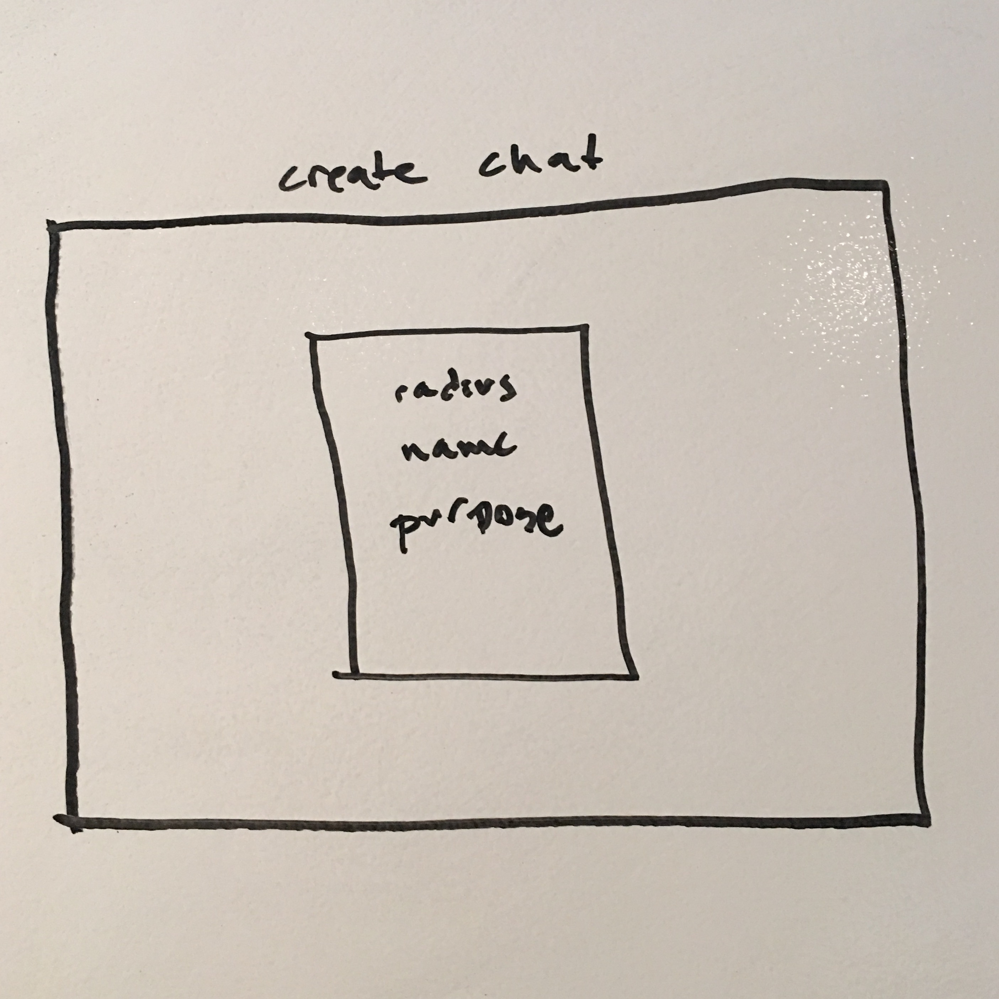

# Circle Chat 

## Intro 
For Project 4, I will be making creating a location-based chat room app that utilizes MEAN stack techonolgies. Users will be able to create a chat room within a certain radius of their location, other users in that "circle" will be added to the chat room and they will be able to communicate with each other. I see this app being used in a variety of setting like a college campus, large and small event, and possibly in disaster-like situations. 

## Approach
This app will be built using MEAN stack to handle the front-end and back-end and will utilize Socket.io for the chat function. I will first get the models working properly, then implement the chat system, then implement the location-based system. 

## Technologies Used:
This project will use the following technologies:

* MEAN stack
* HTML
* CSS/Bootstrap 
* Sockets
* Geolocation

## [Trello](https://trello.com/b/izCaJd5q/wdi-sm-43-project-4)

## Data Model:

## Wireframes:
Sign Up & Log In:

Create Chat:

Chat Room:

